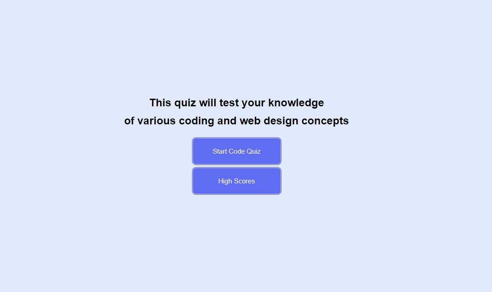

# Code Quiz Challenge

## Installation

This is a browser based software that uses javascript to function. 
​
## Usage 
​
This software was created to practice coding terms using an interactive quiz layout that keeps track of your high score and name.

To advance in the questions you must click one of the answers which will result in a correct or incorrect statement response. Keep in mind there is a timer that will be counting down the entire time. Once the quiz is over, you will be shown your score and given the option to save your highscore with a name. After this you can repeat the process as many times as you would like.

## Built With
* HTML
* CSS
* Javascript

## Website
https://kalib-hicks.github.io/code-quiz/

​
​
## Credits
​
Tutorials:
https://developers.google.com/web/tools/chrome-devtools/javascript/
https://developer.mozilla.org/en-US/docs/Web/JavaScript/Data_structures
https://www.educative.io/edpresso/how-to-create-a-countdown-timer-using-javascript
https://gomakethings.com/using-localstorage-to-save-user-data-with-vanilla-javascript/#:~:text=Use%20setItem()%20to%20store,'%3B%20localStorage.
​
​
​